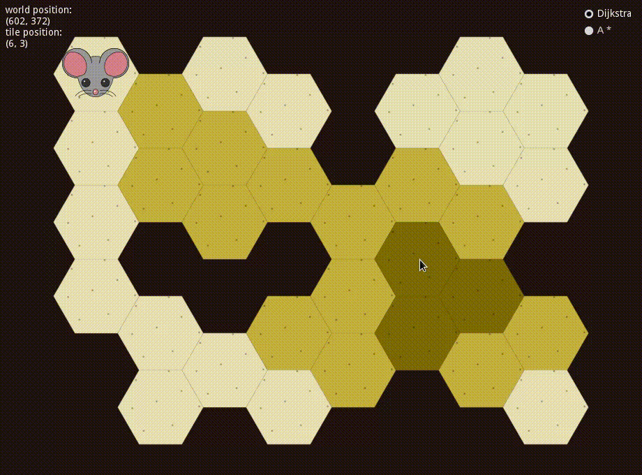

# 2D Hexagonal Map Navigation Demo

This is an example of implementing hexagonal TileMap navigation in Godot.

TileMap cells are rectangular by default. Hexagonal maps are achieved by applying hexagonal tiles to each cell. However, since the tiles don't overlap the cells completely, mouse events aren't always registered within the right cell.

This project provides a solution to this problem.

It features mouse navigation of a player character on a TileMap and path finding using two algorithms (A* and Dijkstra).

